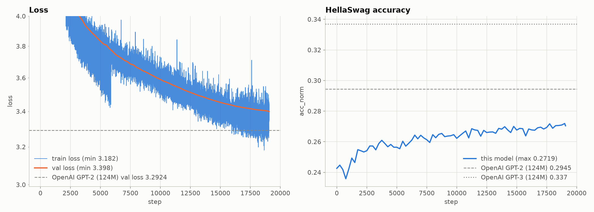

# nanoGPT — GPT-2 (124M) from scratch

A from-scratch reimplementation of GPT-2 small (124M parameters) in PyTorch, built step by step. It is a learning project: the long comments in the code are notes on *why* each piece exists, and are meant to be read alongside it.

The model was trained for one epoch of the FineWeb-Edu 10B-token sample (19,073 steps × ~0.5M tokens), reaching:

| Metric | This run | OpenAI GPT-2 124M (reference) |
|---|---|---|
| FineWeb-Edu val loss | 3.3984 (final step) | 3.2924 |
| HellaSwag `acc_norm` (completion style, 10,042 val examples) | 0.2704 final, 0.2719 best | 0.2955 (measured with `datasets/hellaSwag/hellaswag.py -m gpt2`) |



*Generated from this run's `log/log.txt` by `python docs/make_plots.py`. The loss axis is log-scaled and cut off at 4.0, as in the notebook, so the first ~2,000 steps are above the top of the plot.*

## Documentation

| File | What it covers |
|---|---|
| `README.md` (this file) | Setup, data preparation, training, evaluation, outputs, configuration |
| [`docs/BUILD_LOG.md`](docs/BUILD_LOG.md) | The project built up commit by commit: what was added at each step and why |
| [`docs/ARCHITECTURE.md`](docs/ARCHITECTURE.md) | Reference for the current code: model shapes and parameter counts, data pipeline, anatomy of a training step, evals, DDP, gotchas |

## Repository layout

```
.
├── train.py                     # entry point: hyperparameters, get_lr, main() training loop
├── model.py                     # CausalSelfAttention, MLP, Block, GPTConfig, GPT (+ from_pretrained, configure_optimizers)
├── dataloader.py                # load_tokens, DataLoaderLite (sharded .npy streaming, DDP-aware)
├── evaluation.py                # estimate_val_loss, evaluate_hellaswag, generate_samples, get_most_likely_row
├── distributed.py               # setup_distributed() -> DistributedContext, cleanup_distributed()
├── datasets/
│   ├── fineWeb/fineweb.py       # downloads + tokenizes FineWeb-Edu 10BT into 100M-token shards
│   ├── hellaSwag/hellaswag.py   # downloads HellaSwag, renders examples, evaluates HF GPT-2 as a reference
│   └── tiny_shakespeare/input.txt  # the original toy dataset (no longer used by train.py)
├── docs/                        # BUILD_LOG.md, ARCHITECTURE.md, make_plots.py, images/
├── notebooks/walkthrough.ipynb  # exploration: HF GPT-2 weights, weight tying, init, grad accumulation, log plotting
└── log/                         # created by training (gitignored): log.txt + model_NNNNN.pt checkpoints
```

## Setup

There is no `requirements.txt`. Install these into a Python 3.10+ environment:

```bash
pip install torch numpy tiktoken transformers datasets tqdm requests
pip install matplotlib jupyter   # only for the notebook
```

- `torch` with CUDA for real training. Distributed training (DDP) needs CUDA + NCCL.
- `transformers` is imported by `datasets/hellaSwag/hellaswag.py`, which `train.py` imports through `evaluation.py`, so it is needed even when you are not loading pretrained weights.
- `datasets` (HuggingFace) is used by `fineweb.py` and supplies `pyarrow`, which the HellaSwag downloader uses.

## Step 1: Prepare the training data

```bash
cd datasets/fineWeb && python fineweb.py && cd ../..
```

This downloads the `sample-10BT` subset of [FineWeb-Edu](https://huggingface.co/datasets/HuggingFaceFW/fineweb-edu), tokenizes it with the GPT-2 tokenizer (using half the CPU cores), and writes ~100 shards of 100M tokens each to `datasets/fineWeb/edu_fineweb10B/`:

- `edufineweb_val_000000.npy` — shard 0 is the only validation shard
- `edufineweb_train_000001.npy` … — everything else is training data

Shards are `uint16` (GPT-2's vocab fits in 16 bits), so the full set is ~19 GB on disk. Each document is prefixed with the `<|endoftext|>` token. The directory is gitignored.

HellaSwag needs no preparation: the val split is downloaded into `datasets/hellaSwag/hellaswag/` on first use.

## Step 2: Train

Always run from the **repo root**. The shard path `datasets/fineWeb/edu_fineweb10B` is resolved relative to the current directory, not to `train.py`.

```bash
# single device (auto-detects cuda > mps > cpu)
python train.py

# multi-GPU on one node, e.g. 8 GPUs (CUDA/NCCL only)
torchrun --standalone --nproc_per_node=8 train.py
```

On startup it prints the device, the number of shards found per split, the gradient-accumulation steps, the parameter-group sizes and whether fused AdamW is used. Then one line per step (numbers illustrative):

```
step  250| loss: 5.912345 | lr: 2.1035e-04| norm: 0.53 | dt: 1234.56ms| tokens/sec: 424680.12
```

Every 250 steps (and on the last step) it also runs evaluations: validation loss, HellaSwag accuracy and four text samples from the prompt `"Hello, I'm a language model,"`.

> **macOS / CPU:** the loop calls `torch.cuda.synchronize()` unconditionally after each step, so a full run only works on CUDA. To try it on a Mac you need to guard that line (there is a commented-out `torch.mps.synchronize()` next to it). The working interpreter on the dev Mac is `/opt/anaconda3/envs/torchenv/bin/python`.

### Configuration

There are no CLI flags. Hyperparameters are module-level constants at the top of `train.py`; edit them in place:

| Constant | Value | Meaning |
|---|---|---|
| `total_batch_size` | `524288` (2¹⁹) | Tokens per optimizer step (~0.5M, the GPT-3 small batch size) |
| `B` | `16` | Micro-batch size per GPU. 64 needs an 80GB GPU (it runs out of memory on a 40GB A100) |
| `T` | `1024` | Sequence length |
| `max_lr` / `min_lr` | `6e-4` / `6e-5` | Peak LR, and the floor of the cosine decay (10% of peak) |
| `warmup_steps` | `715` | Linear warmup (≈375M tokens, as in GPT-3) |
| `max_steps` | `19073` | ≈ 10B tokens / 524,288 tokens per step = 1 epoch |
| `use_compile` | `False` | `torch.compile` the model. When `True`, HellaSwag and sampling are skipped |
| `eval_interval` | `250` | Steps between evals |
| `checkpoint_interval` | `5000` | Steps between checkpoints |

Gradient-accumulation steps are derived: `total_batch_size // (B * T * world_size)`. That is 32 micro-steps on 1 GPU and 4 on 8 GPUs. `total_batch_size` must be divisible by `B * T * world_size`.

Because `get_lr` reads these as globals, you can also override them from another script:

```python
import train
train.max_steps = 100
train.warmup_steps = 10
train.main()
```

## Step 3: Outputs

Everything goes to `log/` (gitignored). Note that `log/log.txt` is **truncated at the start of every run**.

**`log/log.txt`** — one metric per line, `{step} {stream} {value}` (numbers illustrative):

```
0 val 10.9512
0 hella 0.2470
0 train 10.954321
1 train 10.012345
...
```

To plot it, run `python docs/make_plots.py` from the repo root. It writes `docs/images/training_curves.png`, using the plotting code from the last cell of `notebooks/walkthrough.ipynb`: train/val loss against the OpenAI GPT-2 baseline (3.2924), and HellaSwag accuracy against the GPT-2 and GPT-3 baselines. It also redraws `docs/images/lr_schedule.png` from `get_lr`. It only needs `numpy` and `matplotlib`.

**`log/model_NNNNN.pt`** — written at steps 5000, 10000, 15000 and at the last step (19072). Each holds `{'model': state_dict, 'config': GPTConfig, 'step', 'val_loss'}`. There is no optimizer state or RNG state, so **training cannot be resumed** from a checkpoint.

### Loading a checkpoint and generating text

```python
import torch
from model import GPT
from evaluation import generate_samples

ckpt = torch.load("log/model_19072.pt", map_location="cpu", weights_only=False)  # config is a pickled dataclass
model = GPT(ckpt["config"])
model.load_state_dict(ckpt["model"])
model.to("cuda")

generate_samples(model, device="cuda", device_type="cuda", ddp_rank=0,
                 num_return_sequences=4, max_length=64,
                 prompt="The meaning of life is")
```

`weights_only=False` is needed on PyTorch ≥ 2.6 because the checkpoint stores the `GPTConfig` object. (If you ever train with `use_compile = True`, the state-dict keys get an `_orig_mod.` prefix that has to be stripped.)

## Evaluating OpenAI's GPT-2 for comparison

```bash
python datasets/hellaSwag/hellaswag.py -m gpt2        # also gpt2-medium, gpt2-large, gpt2-xl
python datasets/hellaSwag/hellaswag.py -m gpt2 -d cuda
```

This runs HuggingFace GPT-2 over all 10,042 HellaSwag val examples, in completion style, and prints running `acc_norm`. Expected: `gpt2` ≈ 0.2955, `gpt2-xl` ≈ 0.4893.

The model in this repo can also load those weights directly with `GPT.from_pretrained('gpt2')`.

## Known limitations

- **CUDA assumed in the loop.** Unguarded `torch.cuda.synchronize()` after each step, see above.
- **No resume.** Checkpoints lack optimizer and RNG state, and `log.txt` is wiped on start.
- **`use_compile = True` disables HellaSwag and sampling**, because they recompile on every new input shape.
- **The val shard is only partly used.** `estimate_val_loss` looks at 20 batches (~330K tokens per rank) of the 100M-token val shard.
- The finished run used slightly older code than what is here now. Biases had PyTorch's default init instead of zeros, and DDP synced gradients on every micro-step. See [`docs/BUILD_LOG.md`](docs/BUILD_LOG.md#step-20--modularize-the-codebase).

## Credits

- Andrej Karpathy, [build-nanogpt](https://github.com/karpathy/build-nanogpt) and the "Let's reproduce GPT-2" video. The structure, hyperparameters, `fineweb.py` and `hellaswag.py` follow it closely.
- Radford et al., *Language Models are Unsupervised Multitask Learners* (GPT-2), and Brown et al., *Language Models are Few-Shot Learners* (GPT-3). GPT-3 supplies the training hyperparameters that the GPT-2 paper leaves out.
- [FineWeb-Edu](https://huggingface.co/datasets/HuggingFaceFW/fineweb-edu) (HuggingFace) and [HellaSwag](https://rowanzellers.com/hellaswag/) (Zellers et al.).
